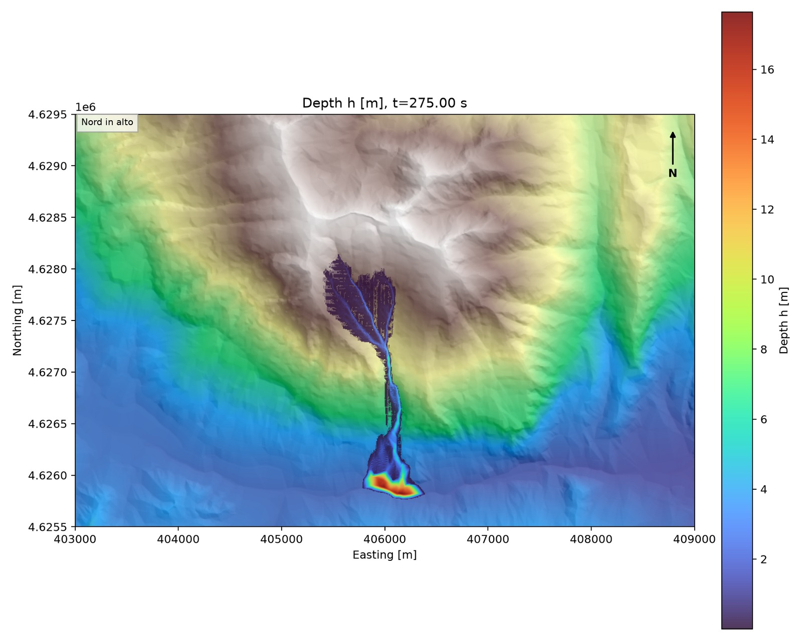
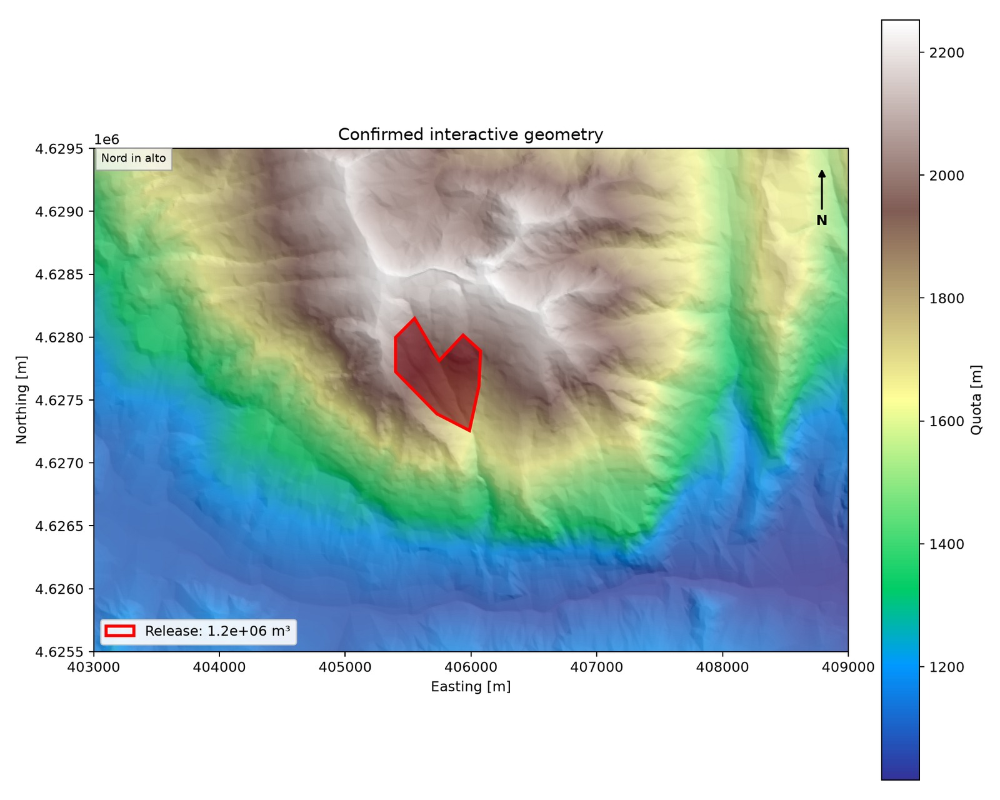
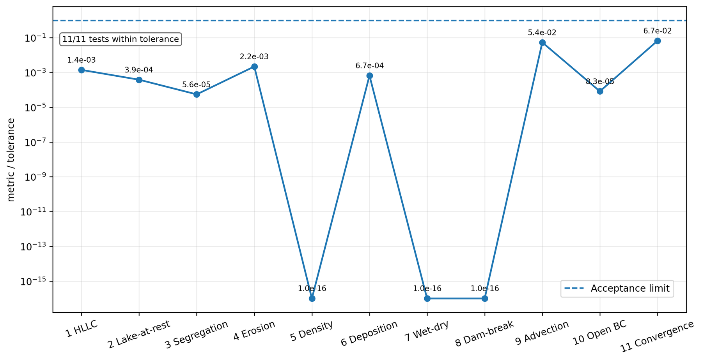
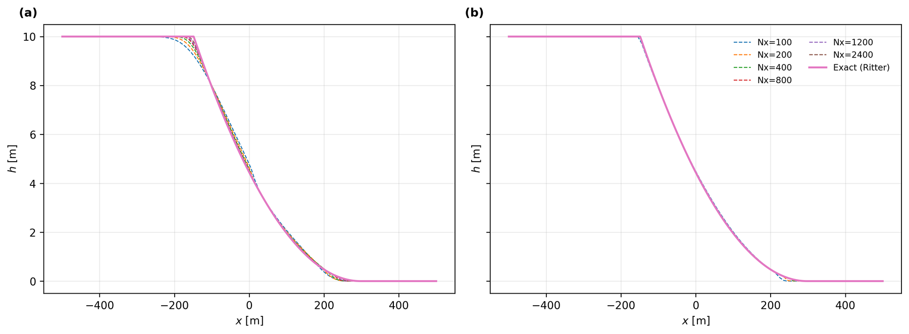

# PyDebrisFlow2D


<div align="center">



<br>

**A conservative Python solver for variable-density debris flows, bed exchange, and grain-size segregation**

<br>


</div>

PyDebrisFlow2D is a modular finite-volume research solver for simulating depth-averaged debris-flow propagation over digital elevation models (DEMs). The code combines shallow-layer flow dynamics, Voellmy-type basal resistance, variable-density mixture bookkeeping, conservative bed exchange, grain-size segregation, and CPU/CUDA execution in a single Python project.

The distributed configurations request CUDA first. If a compatible NVIDIA GPU, CUDA driver, or CUDA runtime is unavailable, the solver and the complete verification workflow automatically continue on the CPU without requiring a different launch command.


## Visual overview

<table>
<tr>
<td width="50%" align="center">
<br>
<strong>Computational setup</strong><br>
<sub>Digital elevation model and prescribed release geometry.</sub>
</td>
<td width="50%" align="center">
<br>
<strong>Grain-size segregation</strong><br>
<sub>Upper-minus-lower coarse fraction in the nominal second-order solution.</sub>
</td>
</tr>
<tr>
<td width="50%" align="center">
<br>
<strong>Controlled verification suite</strong><br>
<sub>Normalized metrics for the implemented physical and numerical checks.</sub>
</td>
<td width="50%" align="center">
<br>
<strong>Ritter benchmark</strong><br>
<sub>First- and nominal second-order depth profiles across the resolution sequence.</sub>
</td>
</tr>
</table>

> The figures above are generated from the verification and Marsicano workflows described in the accompanying scientific paper. They illustrate model behavior and numerical consistency; they do not constitute certification for operational or safety-critical use.


## Main features

- Cartesian finite-volume formulation over real or synthetic topography.
- Depth-averaged, single-velocity mixture dynamics.
- Hydrostatic reconstruction based on the free surface `eta = h + zb`.
- First-order or MUSCL spatial reconstruction.
- Minmod, monotonized central (MC), van Leer, and superbee slope limiters.
- HLLC numerical flux with local HLL fallback near wet/dry fronts or inadmissible star states.
- First- and second-order time integration, including SSPRK2.
- Positivity preservation, conservative round-off repair, and adaptive time-step retries.
- Composition-dependent Voellmy resistance parameters `mu` and `xi`.
- Variable-density fluid, fine-solid, and coarse-solid bookkeeping.
- Conservative erosion, entrainment, deposition, segregation, and remixing operators.
- Interactive release-area and friction-zone definition.
- CPU execution with Numba parallelization.
- GPU-resident CUDA execution with automatic CPU fallback.
- NPZ snapshots, final maps, GIF animations, material budgets, and JSON diagnostics.
- A unified verification workflow contained entirely in `test.py`.

## Repository structure

```text
PyDebrisFlow2D/
├── main.py                         # solver and DEM-preparation command-line interface
├── marsicano_ablation.py           # 16-run Marsicano multiphysics ablation workflow
├── test.py                         # complete unified verification workflow
├── requirements.txt                # Python dependencies
├── CITATION.cff                    # software citation metadata
├── LICENSE                         # Apache License 2.0
├── .gitignore                      # generated files excluded from Git
├── configs/
│   ├── config_marsicano.yaml       # Marsicano case-study configuration
│   ├── config_marsicano_ablation.yaml # Marsicano 2^3 ablation configuration
│   └── config_tests.yaml           # complete verification configuration
├── utils/
│   ├── __init__.py
│   └── prepare_dem.py              # Marsicano DEM preparation utility
├── pydebrisflow/
│   ├── __init__.py                 # public scientific API and version
│   ├── compute.py                  # CPU/CUDA selection and runtime diagnostics
│   ├── config.py                   # typed configuration, YAML loading, validation
│   ├── constants.py                # state indices and numerical identifiers
│   ├── cuda_backend.py             # CUDA kernels and GPU-resident solver
│   ├── dem.py                      # DEM reading, clipping, resampling, and caching
│   ├── geometry.py                 # polygons, masks, hillshade, and setup previews
│   ├── numerics.py                 # finite-volume fluxes and CPU time stepping
│   ├── outputs.py                  # snapshots, maps, and animations
│   ├── physics.py                  # friction and multiphysics source terms
│   └── simulation.py               # simulation workflow and backend dispatch
├── docs/
│   └── images/                     # README figures
├── data/                            # local DEM files (not distributed)
├── cache/                           # generated DEM caches
└── outputs/                         # simulation and verification results
```

Generated `cache/` and `outputs/` directories may be absent before the first execution.

## Requirements

- Python 3.10 or later is recommended.
- A compatible NVIDIA GPU and CUDA environment are optional.
- CPU execution remains available when CUDA cannot be initialized.
- Large real-case simulations and the highest-resolution verification cases may require substantial RAM, GPU memory, storage, and execution time.

The complete dependency list is provided in `requirements.txt`:

- NumPy
- SciPy
- Numba
- Numba CUDA
- PyYAML
- Matplotlib
- ImageIO
- Rasterio
- PyProj

## Installation

Create a virtual environment:

```bash
python -m venv .venv
```

Activate it on Windows PowerShell:

```powershell
.venv\Scripts\Activate.ps1
```

Activate it on Linux or macOS:

```bash
source .venv/bin/activate
```

Upgrade `pip` and install the project dependencies:

```bash
python -m pip install --upgrade pip
python -m pip install -r requirements.txt
```

CUDA-related packages enable GPU execution when a compatible NVIDIA device and driver are available. The normal launch commands remain unchanged on a CPU-only computer because the configured fallback is automatic.

## Quick start

The repository has three primary entry points:

```bash
python main.py
python marsicano_ablation.py
python test.py
```

- `main.py` runs a configured debris-flow simulation or a related setup utility.
- `marsicano_ablation.py` runs the 16-case Marsicano multiphysics ablation study.
- `test.py` validates the repository configurations and runs the complete verification workflow.

## Run the Marsicano simulation

Run the distributed Marsicano configuration with:

```bash
python main.py
```

By default, `main.py` loads:

```text
configs/config_marsicano.yaml
```

The program requests the configured CUDA backend and automatically falls back to the CPU when CUDA is unavailable and `cuda_allow_fallback: true` is set.

Run a different YAML configuration with:

```bash
python main.py --config configs/my_case.yaml
```

Force a backend for the current execution:

```bash
python main.py --backend cuda
python main.py --backend cpu
python main.py --backend auto
```

Override the number of CPU threads:

```bash
python main.py --cpu-threads 8
```

A value of `0` uses the Numba default.

Display CUDA runtime and device information:

```bash
python main.py --cuda-info
```

## Run the Marsicano multiphysics ablation study

The dedicated ablation workflow evaluates how erosion, deposition, and grain-size segregation modify the Marsicano simulation relative to a propagation-only baseline. It uses a complete `2^3` factorial design and repeats all eight physical combinations with first- and second-order discretizations, giving 16 simulations in total.

Run the complete study with:

```bash
python marsicano_ablation.py
```

By default, the script loads:

```text
configs/config_marsicano_ablation.yaml
```

The DEM, crop extent, release polygon, released volume, material properties, Voellmy parameters, final time, boundary conditions, and grid resolution remain fixed across the matrix. Only the numerical order and the activation state of the three multiphysics operators change.

| Case ID | Erosion | Deposition | Segregation | Description |
|---|---:|---:|---:|---|
| `P000` | off | off | off | propagation-only baseline |
| `E100` | on | off | off | erosion only |
| `D010` | off | on | off | deposition only |
| `S001` | off | off | on | segregation only |
| `ED110` | on | on | off | erosion and deposition |
| `ES101` | on | off | on | erosion and segregation |
| `DS011` | off | on | on | deposition and segregation |
| `EDS111` | on | on | on | full multiphysics |

Each case is run as:

- `O1`: first-order space and first-order time integration;
- `O2`: second-order MUSCL space reconstruction and second-order time integration.

The distributed configuration requests CUDA and permits automatic CPU fallback. Override the backend for the current execution with:

```bash
python marsicano_ablation.py --backend cuda
python marsicano_ablation.py --backend cpu
python marsicano_ablation.py --backend auto
```

Validate the YAML file and print the complete matrix without solving:

```bash
python marsicano_ablation.py --dry-run
```

Run only selected numerical orders or physical cases:

```bash
python marsicano_ablation.py --orders O2
python marsicano_ablation.py --cases P000 E100 EDS111
python marsicano_ablation.py --orders O2 --cases P000 EDS111
```

Use a shorter final time only for a temporary execution check:

```bash
python marsicano_ablation.py --t-end 10
```

Completed runs are reused when their `metrics.json`, `final_state.npz`, and configuration fingerprint are consistent. Force all selected cases to run again with:

```bash
python marsicano_ablation.py --no-resume
```

Delete the complete ablation output directory before starting a clean study with:

```bash
python marsicano_ablation.py --restart
```

The script normally creates the same six final comparison maps for every case:

- `h_final.png`;
- `speed_final.png`;
- `rho_final.png`;
- `solid_fraction_final.png`;
- `coarse_fraction_final.png`;
- `segregation_final.png`.

Map generation can be overridden from the command line:

```bash
python marsicano_ablation.py --make-png
python marsicano_ablation.py --no-make-png
python marsicano_ablation.py --overwrite-png
```

The main output directory is:

```text
outputs/Marsicano_Ablation/
├── marsicano_ablation_results.csv
├── first_order/
│   ├── P000_propagation_only/
│   ├── E100_erosion_only/
│   ├── D010_deposition_only/
│   ├── S001_segregation_only/
│   ├── ED110_erosion_deposition/
│   ├── ES101_erosion_segregation/
│   ├── DS011_deposition_segregation/
│   └── EDS111_full_multiphysics/
└── second_order/
    └── the same eight physical cases
```

The crash-safe CSV is rewritten after every completed or failed run. It records execution status, backend and device, elapsed time, grid spacing, wet area, maximum depth and speed, mobile volume and composition, eroded and deposited volumes, segregation transfer, bed-elevation changes, material residuals, HLLC fallback counts, time-step retries, and output paths.

For each numerical order, every active-physics case is compared with its matching `P000` propagation-only baseline using depth errors, speed errors, wet-area change, mobile-volume change, and wet-support intersection over union (IoU). The script also compares the first- and second-order solutions for every matching physical case. These metrics quantify numerical and physical sensitivity within the configured prospective scenario; they do not constitute observational validation of the historical event.

## DEM preparation

Prepare the Marsicano DEM using the utility connected to `main.py`:

```bash
python main.py --prepare-dem
```

The prepared DEM path, crop extent, target resolution, and cache path must remain consistent with `configs/config_marsicano.yaml`.

## Interactive geometry

Draw the two friction regions followed by the release polygon:

```bash
python main.py --interactive-setup
```

Draw only the friction regions:

```bash
python main.py --interactive-friction
```

Draw only the release polygon:

```bash
python main.py --interactive-release-polygon
```

Disable hillshade in setup previews, maps, and animations:

```bash
python main.py --no-hillshade
```

## Parameters to review before a simulation

Before running a new case, check at least:

- DEM path, coordinate reference system, valid-data mask, and spatial resolution;
- crop extent and cache path;
- release geometry, thickness or volume, composition, and initial velocity;
- basal resistance parameters `mu` and `xi`;
- material densities, solid fractions, and grain properties;
- erosion, deposition, and segregation settings;
- boundary conditions;
- spatial order, time order, limiter, CFL number, and maximum time step;
- final simulation time and output interval;
- requested backend, CUDA device, and CPU thread count;
- output directory and available storage.

## Run the complete verification workflow

Run all verification activities with one command:

```bash
python test.py
```

`test.py` is the only verification entry point. It performs the following sequence:

1. validates `configs/config_tests.yaml`;
2. validates `configs/config_marsicano.yaml`;
3. resolves the requested CUDA or CPU backend;
4. runs the general physical and numerical checks;
5. generates the complete general verification figure set;
6. performs the first- and second-order Ritter spatial-resolution study;
7. performs the configured time-step sensitivity study;
8. compares the configured second-order slope limiters;
9. exports figures, profile data, convergence tables, and JSON summaries.

The general checks include:

- HLLC consistency;
- lake-at-rest preservation;
- segregation conservation;
- erosion conservation;
- variable-density closure;
- active deposition conservation;
- wet/dry HLL fallback;
- dam-break positivity and conservation;
- Ritter dam-break comparison;
- composition advection;
- open-boundary material budgets;
- grid-convergence behavior.

The command always runs the complete configured workflow. There are no separate smoke-test, reduced-test, `--gpu`, `--full-gpu`, or `--skip-figures` modes.

Use alternative configuration paths only when needed:

```bash
python test.py \
  --config configs/config_tests.yaml \
  --marsicano-config configs/config_marsicano.yaml
```

The backend and all verification parameter sets are controlled through `config_tests.yaml`.

## Automatic backend selection

The distributed YAML files use the following logic:

```yaml
compute:
  backend: cuda
  cuda_allow_fallback: true
```

At runtime, the program:

1. attempts to import and initialize the CUDA runtime;
2. checks the requested CUDA device;
3. selects the GPU when initialization succeeds;
4. otherwise reports the failure reason and continues on the CPU.

The complete verification suite uses the same selected backend for its configured resolution, time-step, and limiter cases. CPU fallback does not switch to a reduced verification set.

## Configuration files

### `configs/config_marsicano.yaml`

Defines the Marsicano DEM, crop extent, release polygon, uniform material and Voellmy parameters, numerical settings, backend preferences, disabled or enabled multiphysics operators, and output options.

### `configs/config_marsicano_ablation.yaml`

Defines the fixed Marsicano domain and release conditions used by the ablation study, the first- and second-order numerical specifications, the complete eight-case erosion/deposition/segregation matrix, resume behavior, wet threshold, CSV name, comparison-map settings, and ablation output root.

### `configs/config_tests.yaml`

Provides a complete `SolverConfig` for repository-level validation and a dedicated `tests` section read directly by `test.py`.

The `tests` section controls:

- verification figure directory;
- reference second-order limiter;
- list of limiters to compare;
- spatial resolutions;
- fixed time steps;
- temporal-study resolution;
- limiter-profile resolution;
- Ritter domain and dam position;
- initial reservoir depth;
- final time;
- monitor position;
- verification CFL number.

Relative paths are resolved from the directory containing each YAML file.

The main solver sections are:

- `compute`: backend, CPU threads, CUDA device, and CUDA launch controls;
- `grid`: DEM path, ZIP member, cache, crop extent, and target resolution;
- `numerics`: gravity, CFL, time step, final time, flux, limiter, order, and boundaries;
- `material`: densities, composition, Voellmy parameters, yield term, and grain properties;
- `friction`: uniform or spatially overridden `mu` and `xi` values;
- `release`: geometry, volume, composition, speed, and direction;
- `erosion`: entrainment law, erodible depth, bed composition, and bed updating;
- `deposition`: critical shear and settling controls;
- `segregation`: segregation and remixing controls;
- `output`: output directory, snapshots, maps, GIFs, progress, and hillshade.

Create a copy of an existing configuration before adapting the solver to another site. Retain the resolved configuration together with every reported simulation result.

## Simulation outputs

Depending on `output` settings, a simulation can generate:

- `config_resolved.yaml`: complete configuration used at runtime;
- setup preview images for the DEM, release, and friction regions;
- `state_*.npz`: time-dependent state snapshots;
- final maps for depth, speed, and enabled composition fields;
- `depth_evolution.gif`: animated depth evolution;
- `metrics.json`: backend, grid, time-stepping, conservation, and material-budget diagnostics;
- `final_state.npz`: final conservative state, DEM, bed inventories, peak shear, friction overrides, and release mask.

Do not evaluate a run from maps or animations alone. Review the numerical metrics, material residuals, wet/dry treatment, fallback counts, retry counts, boundary exchanges, and spatial and temporal sensitivity.

## Marsicano ablation outputs

With the distributed configuration, `marsicano_ablation.py` writes its products under:

```text
outputs/Marsicano_Ablation/
```

The root directory contains the continuously updated `marsicano_ablation_results.csv`. Each order/case subdirectory contains the normal solver products, including `metrics.json`, `final_state.npz`, the resolved configuration, an `ablation_run.json` configuration fingerprint, and the six optional final PNG comparison maps.

A failed case is retained in the CSV with its error message. Unless `--fail-fast` is used, the workflow continues with the remaining selected simulations.

## Verification outputs

With the distributed configuration, `test.py` writes its products under:

```text
outputs/verification_figures/
```

The directory contains:

- `test_00_summary.png`;
- publication-ready figures for tests 01–12;
- `figure_metrics.json`;
- Ritter profile CSV files for first- and second-order simulations;
- Ritter profile CSV files for each configured limiter;
- spatial error and observed-order tables;
- time-step sensitivity tables;
- monitor-depth tables;
- eight main comparison figures in PNG and PDF formats;
- `backend_verification_summary.json`.

A successful run confirms that the implemented checks passed for the tested software environment and configuration. ## Python API

The scientific components can be imported directly:

```python
import pydebrisflow as pdf
```

Example configuration loading and validation:

```python
import pydebrisflow as pdf

cfg = pdf.load_config("configs/config_marsicano.yaml")
pdf.validate_config(cfg)
metrics = pdf.run_solver(cfg)
```

The public API may evolve between releases. Record the exact software release, configuration, and dependency environment used for every reproducible experiment.

## Reproducible scientific use

For each published or shared simulation, retain:

- the exact PyDebrisFlow2D release or commit;
- the complete input and resolved YAML configurations;
- the original and prepared DEMs;
- the DEM coordinate reference system and processing history;
- release and friction geometries;
- initial and boundary conditions;
- rheological and multiphysics parameters;
- selected CPU or CUDA backend and device information;
- Python and dependency versions;
- relevant random seeds;
- conservation diagnostics;
- mesh and time-step sensitivity results;
- verification results;
- any local code modifications.

The implementation includes hydrostatic reconstruction, HLL/HLLC approximate Riemann solvers, MUSCL reconstruction, SSPRK time integration, Voellmy-type basal resistance, Ferguson–Church settling, and a conservative two-layer representation for segregation and remixing. Cite the numerical, physical, and case-study references appropriate to the specific application.

## Citation

When using PyDebrisFlow2D in scientific work:

1. cite the exact software release used in the analysis;
2. archive the associated configuration and input data when possible;
3. cite the related peer-reviewed scientific article when available.


## License

PyDebrisFlow2D is distributed under the Apache License, Version 2.0. See the `LICENSE` file for the complete terms.

The license permits use, modification, and redistribution, including commercial use, subject to its conditions. Redistributed copies must preserve the applicable copyright, license, attribution, and notice information.

## Research software, safety, and limitation-of-liability disclaimer

PyDebrisFlow2D is research software intended for scientific research, numerical experimentation, education, and method development.

Simulation outputs depend on model assumptions, input data, digital elevation model quality, release geometry, initial and boundary conditions, material and rheological parameters, source-term parameterizations, calibration, numerical resolution, time-step selection, software dependencies, hardware, and user-defined configurations. 

Results must be independently reviewed and validated by appropriately qualified professionals before being used in engineering design, hazard assessment, territorial or land-use planning, emergency management, regulatory procedures, or decisions affecting people, property, infrastructure, or the environment. 

PyDebrisFlow2D is provided on an **“AS IS”** and **“AS AVAILABLE”** basis, without warranties or conditions of any kind, whether express, implied, statutory, or otherwise, including, without limitation, warranties of accuracy, reliability, completeness, merchantability, fitness for a particular purpose, non-infringement, or regulatory compliance, to the maximum extent permitted by applicable law.

Users are solely responsible for determining whether the software is suitable for their intended purpose, selecting and verifying input data and parameters, reviewing and validating all results, obtaining any required professional or regulatory approvals, and complying with applicable laws, professional standards, institutional procedures, and safety requirements.

To the maximum extent permitted by applicable law, the authors and contributors shall not be liable for any direct, indirect, incidental, special, exemplary, or consequential damages, or for any loss of data, profits, business, property, or opportunity, arising from the use of, inability to use, or reliance on the software or its outputs, regardless of the legal theory asserted and even if advised of the possibility of such damages.

This disclaimer supplements the project documentation but does not replace, amend, or override the terms of the Apache License 2.0. No disclaimer or open-source license excludes liability where such exclusion is prohibited by applicable law.
