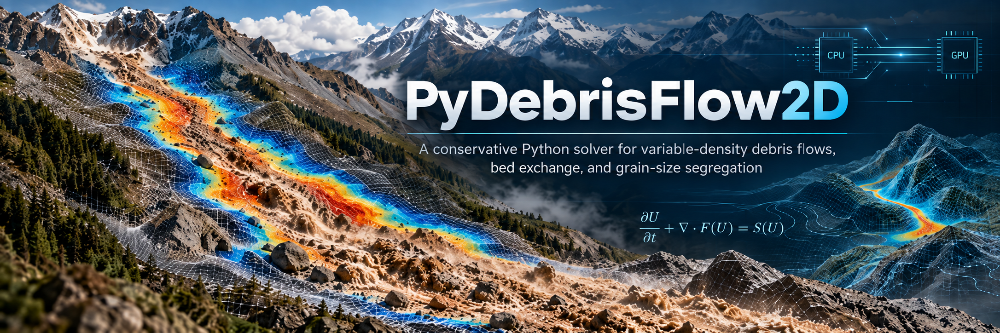

<div align="center">



<br>


</div>

---

**PyDebrisFlow2D** is an open-source, conservative, two-dimensional finite-volume research solver for depth-averaged debris-flow propagation over raster digital elevation models (DEMs).

The code combines hydrostatic reconstruction, HLL/HLLC approximate Riemann solvers, optional MUSCL reconstruction, first- or second-order time integration, variable-density mixture bookkeeping, alternative basal-resistance closures, conservative bed exchange, reduced two-layer grain-size segregation, wet/dry safeguards, and CPU/CUDA execution.

The repository also provides a reproducible verification and publication workflow, including controlled numerical tests, Marsicano real-topography experiments, grid and CFL sensitivity studies, reviewer-oriented physical diagnostics, concentration-dependent rheology tests, and CPU/CUDA performance benchmarks.

> **Research software.** PyDebrisFlow2D is intended for scientific research, numerical experimentation, education, and method development. It is not a certified engineering tool, operational forecasting system, hazard-warning system, emergency-management platform, or early-warning system.

## Highlights

- Conservative finite-volume formulation on Cartesian grids.
- Real or synthetic raster DEM support.
- Depth-averaged two-dimensional mixture motion.
- Variable-density constituent bookkeeping.
- Hydrostatic reconstruction and topographic source balancing.
- HLL and HLLC fluxes.
- Local HLL fallback for difficult reconstructed states.
- First-order and MUSCL spatial reconstruction.
- Euler and SSPRK2 time integration.
- Minmod, MC, van Leer, and superbee slope limiters.
- Wet/dry treatment and positivity safeguards.
- Conservative roundoff repair and adaptive retry logic.
- Alternative **Voellmy** and **concentration-aware O'Brien-Julien** basal-resistance closures.
- Conservative erosion/entrainment and class-resolved deposition.
- Reduced two-layer grain-size segregation and remixing.
- Numba CPU execution.
- CUDA acceleration on compatible NVIDIA GPUs.
- Verification, regression, sensitivity, and performance workflows.
- Publication-oriented maps, tables, logs, NPZ products, and optional GIF outputs.

## Governing-equation form

PyDebrisFlow2D solves a conservative depth-averaged balance-law system of the generic form:

$$
\frac{\partial \mathbf{U}}{\partial t}
+
\nabla \cdot \mathbf{F}(\mathbf{U})
=
\mathbf{S}(\mathbf{U})
$$

or, explicitly in two horizontal dimensions,

$$
\frac{\partial \mathbf{U}}{\partial t}
+
\frac{\partial \mathbf{F}(\mathbf{U})}{\partial x}
+
\frac{\partial \mathbf{G}(\mathbf{U})}{\partial y}
=
\mathbf{S}(\mathbf{U})
$$

where $\mathbf{U}$ is the vector of conservative state variables, $\mathbf{F}$ and $\mathbf{G}$ are the horizontal flux vectors, and $\mathbf{S}$ contains the source terms associated with topography, basal resistance, bed exchange, deposition, segregation, and other enabled physical processes.

## Resistance closures

PyDebrisFlow2D exposes two **alternative** basal-resistance closures. They are selected per simulation and are **not added together**.

### Voellmy

The Voellmy closure is the reference mobility formulation used for the Marsicano benchmark, the multiphysics ablation matrix, the real-topography grid study, the CFL study, and the CPU/CUDA benchmark.

It provides the reference configuration used to preserve consistency with the modelling framework adopted for the Marsicano numerical experiments.

### Concentration-aware O'Brien-Julien

The O'Brien-Julien option is intended for applications in which resistance is required to evolve explicitly with solid volume fraction.

The current implementation includes a continuous-asymptotic transition toward the carrier-fluid limit. This transition is a PyDebrisFlow2D regularization and should not be presented as a verbatim equation from the original O'Brien-Julien literature.

The distributed short Marsicano O'Brien-Julien case is an **integration check**, not a field calibration or observational validation.

## Physical scope and limitations

PyDebrisFlow2D uses one common depth-averaged mixture-velocity vector for all transported constituents. The two Cartesian velocity components describe horizontal map-plane motion, not fluid-solid phase slip.

The current formulation does not explicitly resolve:

- phase-specific momentum equations;
- fluid-solid relative velocity;
- dynamic pore-pressure evolution;
- non-hydrostatic vertical acceleration;
- continuous vertical concentration profiles;
- individual boulder impacts;
- fully three-dimensional free-fall dynamics.

The fixed Cartesian grid also limits the representation of very narrow channels and sharp evolving-bed geometries.

The finest terrain information distributed for the Marsicano case is **5 m**. Solver grids finer than 5 m would interpolate the same terrain dataset rather than add independently observed geomorphic information. For this reason, the supplied real-topography refinement study stops at the native 5 m DEM resolution.

## Repository layout

```text
PyDebrisFlow2D/
├── pydebrisflow/                  # core solver package
├── configs/                       # YAML configurations
│   ├── verification.yaml
│   ├── marsicano_voellmy.yaml
│   ├── marsicano_multiphysics.yaml
│   └── obrien_julien_quick.yaml
├── data/                          # distributed Marsicano DEM
│   └── w46090_s10_Marsicano_UTM33_5m.tif
├── tests/                         # regression, integration and benchmark checks
├── docs/
│   └── images/
│       └── PyDebrisFlow2D_banner.png
├── prepare_dem.py                 # DEM preparation helper
├── verify_core.py                 # controlled numerical verification
├── run_simulation.py              # run one configured simulation
├── run_marsicano_studies.py       # ablation + grid/GCI studies
├── run_reviewer_diagnostics.py    # reviewer-oriented diagnostics
├── run_cfl_study.py               # temporal CFL robustness study
├── run_full_suite.py              # complete publication workflow
├── requirements.txt
├── pyproject.toml
├── CITATION.cff
├── LICENSE
└── README.md
```

Generated `cache/` and `outputs/` directories are runtime products and should not be committed to Git.

## Installation

Python **3.10 or later** is recommended.

### 1. Clone the repository

```bash
git clone https://github.com/Secchi93/PyDebrisFlow2D.git
cd PyDebrisFlow2D
```

### 2. Create a virtual environment

```bash
python -m venv .venv
```

Windows PowerShell:

```powershell
.venv\Scripts\Activate.ps1
```

Linux/macOS:

```bash
source .venv/bin/activate
```

### 3. Install the dependencies

```bash
python -m pip install --upgrade pip
python -m pip install -r requirements.txt
```

For editable/development installation:

```bash
python -m pip install -e .
```

## Quick start

### Run the reference Marsicano Voellmy case

Windows:

```powershell
python run_simulation.py --config configs\marsicano_voellmy.yaml --backend cuda
```

Linux/macOS:

```bash
python run_simulation.py --config configs/marsicano_voellmy.yaml --backend cuda
```

Use `--backend cpu` if CUDA is not available.

### Run the short O'Brien-Julien integration case

Windows:

```powershell
python run_simulation.py --config configs\obrien_julien_quick.yaml --backend cuda
```

Linux/macOS:

```bash
python run_simulation.py --config configs/obrien_julien_quick.yaml --backend cuda
```

## Complete publication suite

The canonical workflow is driven by:

```text
run_full_suite.py
```

For a fresh CUDA run on Windows:

```powershell
python run_full_suite.py --backend cuda --fresh
```

The `--fresh` option removes previous generated outputs and the DEM cache before starting.

The complete publication profile contains **12 stages**:

1. reviewer/GCI regression checks;
2. CFL-driver regression checks;
3. concentration-aware O'Brien-Julien regression checks;
4. Windows redirected-console compatibility;
5. dense concentration sweep;
6. controlled numerical verification and Ritter accuracy/cost products;
7. 16-case Marsicano Voellmy multiphysics ablation matrix;
8. Marsicano real-topography grid/GCI/bottleneck study;
9. reviewer-requested physical and parameter diagnostics;
10. native-5 m CFL robustness study;
11. short O'Brien-Julien real-DEM end-to-end integration check;
12. matched CPU/CUDA performance benchmark.

At completion, inspect:

```text
outputs/publication_manifest.json
outputs/suite_summary.csv
outputs/artifact_index.csv
outputs/*.log
outputs/figures/*
```

### Inspect the commands without running simulations

```powershell
python run_full_suite.py --backend cuda --fresh --dry-run
```

### Short wiring test

```powershell
python run_full_suite.py --backend cuda --fresh --smoke --skip-performance
```

> The smoke profile is intended only to verify software wiring and must not be used as publication evidence.

### Skip only the performance benchmark

```powershell
python run_full_suite.py --backend cuda --fresh --skip-performance
```

### Stop at the first failed stage

```powershell
python run_full_suite.py --backend cuda --fresh --fail-fast
```

## Main configurations

### `configs/marsicano_voellmy.yaml`

Reference propagation configuration using the Voellmy closure.

### `configs/marsicano_multiphysics.yaml`

Marsicano configuration used by the multiphysics ablation, real-topography grid study, and reviewer-oriented experiments.

### `configs/obrien_julien_quick.yaml`

Short concentration-aware O'Brien-Julien real-DEM integration case.

### `configs/verification.yaml`

Configuration used by the controlled numerical verification workflow.

## Controlled numerical verification

The core verification driver is:

```powershell
python verify_core.py
```

The project includes numerical checks designed to exercise major components of the finite-volume solver, including balance, transport, wet/dry handling, conservation, convergence, and numerical-order behavior.

Verification products generated by the publication workflow include controlled test outputs and Ritter accuracy-versus-cost analyses.

## Fast regression checks

The following tests are intended to run without reproducing the complete expensive publication suite:

```powershell
python tests\test_reviewer_regression.py
python tests\test_concentration_rheology.py
python tests\test_concentration_sweep.py
python tests\test_cfl_regression.py
python tests\test_windows_console_compat.py
```

The O'Brien-Julien end-to-end test is intentionally heavier because it executes the real solver on the Marsicano DEM:

```powershell
python tests\test_oj_end_to_end.py --backend cuda --output-root outputs\oj_check
```

## Marsicano multiphysics studies

The main Marsicano study driver is:

```text
run_marsicano_studies.py
```

It supports the publication-oriented multiphysics ablation and real-topography grid studies.

### 16-case first-/second-order ablation matrix

The physical ablation uses the eight combinations of erosion, deposition, and segregation:

| ID | Erosion | Deposition | Segregation |
|---|:---:|:---:|:---:|
| `P000` | off | off | off |
| `E100` | on | off | off |
| `D010` | off | on | off |
| `S001` | off | off | on |
| `ED110` | on | on | off |
| `ES101` | on | off | on |
| `DS011` | off | on | on |
| `EDS111` | on | on | on |

Each physical combination can be run with first- and second-order numerics.

Useful options include:

```powershell
python run_marsicano_studies.py --dry-run
python run_marsicano_studies.py --orders O2
python run_marsicano_studies.py --cases P000 EDS111
python run_marsicano_studies.py --backend cpu
python run_marsicano_studies.py --backend cuda
python run_marsicano_studies.py --restart
python run_marsicano_studies.py --no-resume
```

## Real-topography grid sensitivity

The Marsicano study uses the native 5 m DEM as the finest terrain-informed dataset.

The controlled refinement sequence used by the project is:

```text
20 m
15 m
10 m
8 m
6.5 m
5 m
```

The workflow can report quantities such as:

- maximum final depth;
- maximum final speed;
- high-percentile wet-cell depth and speed;
- wet area;
- mobile volume;
- distance from the release centroid;
- solver wall time;
- accepted step count;
- cross-grid depth differences;
- cross-grid speed differences;
- wet-support overlap metrics.

Any interpolation used in the comparison is diagnostic only; it does not create a finer DEM and is not used by the solver as additional terrain information.

## CFL robustness study

The temporal CFL study is driven by:

```powershell
python run_cfl_study.py --backend cuda
```

The default native-5 m sequence is:

```text
CFL = 0.25
CFL = 0.15
CFL = 0.10
CFL = 0.075
```

The default final time is:

```text
275 s
```

The driver compares the same spatial model while varying the CFL number so that time-step sensitivity remains separated from grid sensitivity.

A dry run is available:

```powershell
python run_cfl_study.py --backend cuda --dry-run
```

Sub-5 m runs are intentionally rejected because the distributed DEM has 5 m native spacing.

## Reviewer-oriented diagnostics

Run:

```powershell
python run_reviewer_diagnostics.py --all --backend cuda
```

The diagnostic driver includes experiments designed to examine model assumptions and sensitivity separately from observational validation.

Available diagnostic modes include:

- synthetic diagnostics;
- parameter sensitivity;
- hydrostatic-state curvature diagnostics when a compatible `final_state.npz` is supplied;
- wet-threshold controls;
- selected grid-spacing and final-time overrides.

Examples:

```powershell
python run_reviewer_diagnostics.py --synthetic
python run_reviewer_diagnostics.py --parameter-sensitivity --backend cuda
python run_reviewer_diagnostics.py --all --backend cuda
```

These outputs should be interpreted as numerical or physical-model diagnostics unless an independent observational dataset is explicitly introduced.

## CPU/CUDA benchmark

The project includes a matched implementation-performance benchmark:

```powershell
python tests\test_cpu_cuda_benchmark.py
```

The benchmark is conceptually separate from model sensitivity because it evaluates implementation performance rather than physical behavior.

Performance reporting should retain:

- selected grid resolution;
- numerical order;
- CPU/GPU backend;
- wall-clock time;
- accepted step count;
- time per accepted step;
- speedup;
- relevant hardware information;
- Python and dependency versions.

## Configuration structure

The YAML files expose the main solver controls.

Principal configuration groups include:

- `compute`
- `grid`
- `numerics`
- `material`
- `rheology`
- `friction`
- `release`
- `erosion`
- `deposition`
- `segregation`
- `output`

Experiment-specific configuration files may contain additional blocks for ablation, grid sensitivity, reviewer diagnostics, or related publication workflows.

## Typical simulation outputs

Depending on the selected configuration, a run may produce:

```text
config_resolved.yaml
runtime_geometry.yaml
interactive_setup.png
state_*.npz
metrics.json
final_state.npz
depth_evolution.gif
```

Maps may include quantities such as:

- flow depth;
- speed;
- Cartesian velocity components;
- terrain-aligned velocities;
- mixture density;
- solid fraction;
- coarse fraction;
- segregation-related fields.

The full publication suite additionally collects summary tables, artifact indexes, manifests, logs, and figures under `outputs/`.

## Scientific interpretation

The Marsicano products distributed through the workflow are numerical benchmark/back-analysis products. They should not be described as observational validation unless independent field observations are introduced and quantitatively compared against the simulations.

Likewise, a successful verification test demonstrates consistency with the specific numerical property being tested; it does not establish field-scale predictive validity.

Model results depend on:

- governing assumptions;
- DEM quality and resolution;
- release geometry;
- initial and boundary conditions;
- material composition;
- rheological parameters;
- bed-exchange parameters;
- segregation parameters;
- spatial resolution;
- time-step controls;
- calibration strategy;
- software version;
- hardware/backend behavior.

For applied hazard or engineering interpretation, outputs should not be assessed from maps alone. Conservation residuals, material budgets, fallback counts, retries, wet/dry behavior, grid sensitivity, CFL sensitivity, parameter sensitivity, and model assumptions should also be reviewed.

## Reproducible scientific use

For every published or shared simulation, retain:

- the exact PyDebrisFlow2D release or Git commit;
- the complete input YAML configuration;
- resolved configuration files;
- the original DEM;
- any prepared or resampled DEM;
- the DEM coordinate reference system;
- DEM-processing history;
- release geometry;
- friction geometry;
- initial conditions;
- boundary conditions;
- rheological parameters;
- erosion/deposition parameters;
- segregation parameters;
- CPU/CUDA backend selection;
- hardware information;
- Python version;
- dependency versions;
- relevant random seeds;
- conservation diagnostics;
- grid-sensitivity results;
- time-step/CFL-sensitivity results;
- verification results;
- any local code modifications.

## Citation

Software citation metadata are provided in:

```text
CITATION.cff
```

The current software metadata identify release **v1.4.0**.

When using PyDebrisFlow2D in scientific work:

1. cite the exact software release or commit used;
2. archive the corresponding configurations and input data when possible;
3. cite the associated peer-reviewed scientific publication when available.

Keep the software version in `CITATION.cff` synchronized with `pydebrisflow.__version__` before creating a new release.

## License

PyDebrisFlow2D is distributed under the **Apache License 2.0**.

See [`LICENSE`](LICENSE) for the complete terms.

The license permits use, modification, and redistribution, including commercial use, subject to its conditions.

## Disclaimer

PyDebrisFlow2D is research software intended for scientific research, numerical experimentation, education, and method development.

Simulation outputs depend on model assumptions, input data, DEM quality, release geometry, initial and boundary conditions, material and rheological parameters, source-term parameterizations, calibration, numerical resolution, time-step selection, software dependencies, hardware, and user-defined configurations.

Results must be independently reviewed and validated by appropriately qualified professionals before being used in engineering design, hazard assessment, territorial or land-use planning, emergency management, regulatory procedures, or decisions affecting people, property, infrastructure, or the environment.

The software and its outputs must not be used as the sole basis for safety-critical or operational decisions.

PyDebrisFlow2D is provided on an **“AS IS”** and **“AS AVAILABLE”** basis, without warranties or conditions of any kind, whether express, implied, statutory, or otherwise, to the maximum extent permitted by applicable law.

Users are responsible for determining whether the software is suitable for their intended purpose, selecting and verifying input data and parameters, reviewing and validating all results, obtaining any required professional or regulatory approvals, and complying with applicable laws, professional standards, institutional procedures, and safety requirements.

This disclaimer supplements the project documentation but does not replace, amend, or override the terms of the Apache License 2.0.

---

<div align="center">

**PyDebrisFlow2D v1.4.0**

Conservative finite-volume research software for two-dimensional debris-flow simulation.

</div>
